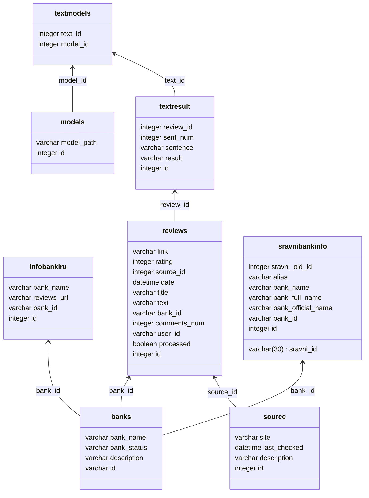

# Database

```mermaid
classDiagram
    direction BT
    class banks {
       varchar bank_name
       varchar bank_status
       varchar description
       varchar id
    }
    class infobankiru {
       varchar bank_name
       varchar reviews_url
       varchar bank_id
       integer id
    }
    class models {
       varchar model_path
       integer id
    }
    class reviews {
       varchar link
       integer rating
       integer source_id
       datetime date
       varchar title
       varchar text
       varchar bank_id
       integer comments_num
       varchar user_id
       boolean processed
       integer id
    }
    class source {
       varchar site
       datetime last_checked
       varchar description
       integer id
    }
    class sravnibankinfo {
       varchar(30) sravni_id
       integer sravni_old_id
       varchar alias
       varchar bank_name
       varchar bank_full_name
       varchar bank_official_name
       varchar bank_id
       integer id
    }
    class textmodels {
       integer text_id
       integer model_id
    }
    class textresult {
       integer review_id
       integer sent_num
       varchar sentence
       varchar result
       integer id
    }

    banks  -->  infobankiru : bank_id
    banks  -->  reviews : bank_id
    source  -->  reviews : source_id
    banks  -->  sravnibankinfo : bank_id
    models  -->  textmodels : model_id
    textresult  -->  textmodels : text_id
    reviews  -->  textresult : review_id
```
